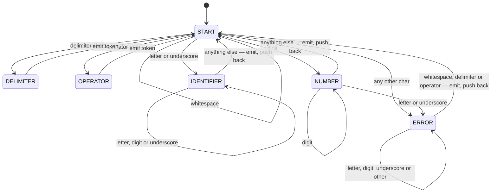

# DFA-Based Lexical Analyser

A lexical analyser for a C-like source language, implemented in portable **C99** as an explicit
**deterministic finite automaton (DFA)**. The scanner reads a source file character by character,
drives a hand-written state machine, and emits a stream of classified tokens annotated with their
exact line and column of origin.

The implementation is deliberately small and dependency-free: no `lex`/`flex`, no regular-expression
engine, no dynamic allocation. Every transition is explicit in [dfa.c](src/dfa.c), which keeps the
automaton auditable against its formal specification.

---

## Table of Contents

- [Highlights](#highlights)
- [Repository Layout](#repository-layout)
- [Quick Start](#quick-start)
- [Command-Line Interface](#command-line-interface)
- [Output Format](#output-format)
- [Recognised Language](#recognised-language)
- [DFA Design](#dfa-design)
- [Error Handling and Panic-Mode Recovery](#error-handling-and-panic-mode-recovery)
- [Implementation Notes](#implementation-notes)
- [Testing](#testing)
- [Known Limitations](#known-limitations)
- [Known Issues](#known-issues)
- [Build Configuration Reference](#build-configuration-reference)

---

## Highlights

| | |
|---|---|
| **Language** | C99 (`-Wall -Wextra -Werror -pedantic`, warning-free) |
| **Build system** | CMake ≥ 3.20, single executable target `lexer` |
| **Dependencies** | C standard library only |
| **Memory model** | Fully static — zero heap allocation, one 256-byte lexeme buffer |
| **Automaton** | 6 states, explicit transition function |
| **Token classes** | 6 (`KEYWORD`, `IDENTIFIER`, `NUMBER`, `OPERATOR`, `DELIMITER`, `ERROR`) |
| **Diagnostics** | Line/column for every token; panic-mode recovery on malformed input |
| **Release binary** | 49,152 bytes — within the project's 50 KB size budget |
| **Test suite** | 9 regression tests, 20,105 expected tokens, all passing |

---

## Repository Layout

```
.
├── CMakeLists.txt          # Build definition (C99, strict warnings, -Os size budget)
├── src/
│   ├── main.c              # Entry point: argument handling, file I/O, output wiring
│   ├── dfa.h / dfa.c       # State enum, character-class predicates, transition function
│   ├── lexer.c / lexer.h   # DFA driver: lexeme accumulation, lookahead, position tracking
│   ├── keywords.h / .c     # Reserved-word table and identifier/keyword disambiguation
│   ├── logger.h / .c       # Token formatting and dual-sink (stdout + file) emission
│   └── token.h             # TokenType enumeration
├── tests/
│   ├── inputs/             # Test source files (test_*.c)
│   ├── expected/           # Golden outputs (test_*.txt)
│   ├── run_test.ps1        # Single-test runner with line-by-line diff on failure
│   ├── run_all.ps1         # Full suite runner
│   └── test_readme.md      # Per-test rationale
└── tokens.out              # Sample output (default output filename)
```

### Module Responsibilities

The codebase separates the *automaton* from the *driver* from the *presentation layer*:

| Module | Responsibility | Depends on |
|---|---|---|
| [dfa.c](src/dfa.c) | Pure transition function `δ(state, char) → state` and character-class predicates. No I/O, no state. | — |
| [lexer.c](src/lexer.c) | Drives the automaton over the input stream; accumulates lexemes; tracks line/column; decides *when* a token is complete. | `dfa`, `keywords`, `logger`, `token` |
| [keywords.c](src/keywords.c) | Resolves a completed identifier lexeme to `KEYWORD` or `IDENTIFIER`. | `token` |
| [logger.c](src/logger.c) | Formats and writes tokens to stdout and (optionally) a file. | `token` |
| [main.c](src/main.c) | CLI parsing, file lifecycle, wiring the output sink. | `lexer`, `logger` |

This layering means the DFA can be unit-reasoned about in isolation, and the output destination can be
changed without touching the scanner.

---

## Quick Start

### Prerequisites

- CMake **3.20** or newer
- A C99 compiler — GCC, Clang, or MSVC
- A generator such as Ninja or Make (the project was developed with CLion's bundled MinGW GCC + Ninja)

### Build

```bash
# Release build (size-optimised, matches the 50 KB budget)
cmake -S . -B cmake-build-release -G Ninja -DCMAKE_BUILD_TYPE=Release
cmake --build cmake-build-release
```

```bash
# Debug build (symbols, no optimisation)
cmake -S . -B cmake-build-debug -G Ninja -DCMAKE_BUILD_TYPE=Debug
cmake --build cmake-build-debug
```

The resulting executable is `cmake-build-release/lexer` (`lexer.exe` on Windows).

> **Note** — `CMAKE_C_FLAGS_RELEASE` is set to `-Os -s`, which is GCC/Clang syntax. Building Release
> with MSVC requires overriding that variable.

### Run

```bash
./cmake-build-release/lexer tests/inputs/test_1.c
```

Tokens are printed to the terminal and simultaneously written to `tokens.out`.

---

## Command-Line Interface

```
lexer <input-file> [output-file]
```

| Argument | Required | Description |
|---|---|---|
| `<input-file>` | Yes | Source file to tokenise. Opened in text mode. |
| `[output-file]` | No | Destination for the token stream. Defaults to `tokens.out`. |

Tokens are always written to **both** stdout and the output file, so the tool can be piped in a shell
pipeline while still leaving a durable artefact on disk.

### Exit Codes

| Code | Meaning |
|---|---|
| `0` | Input was scanned to completion. **Lexical errors do not change the exit code** — they are reported as `ERROR` tokens in the stream. |
| `1` | No input file supplied, the input file could not be opened, or the output file could not be created. |

---

## Output Format

Each token occupies one line, produced by the format string in [logger.c:11](src/logger.c#L11):

```c
"Line %2d, Column %2d: %-10s \"%s\"\n"
```

The line and column identify the **first character** of the lexeme, both 1-based. The token class is
left-padded to 10 columns so that lexemes align in the output.

### Example

Input (`tests/inputs/test_2.c`, excerpt):

```c
int x = 123abc;
```

Output:

```
Line  3, Column  1: KEYWORD    "int"
Line  3, Column  5: IDENTIFIER "x"
Line  3, Column  7: OPERATOR   "="
Line  3, Column  9: ERROR      "123abc"
Line  3, Column 15: DELIMITER  ";"
```

---

## Recognised Language

### Token Classes

| Class | Definition |
|---|---|
| `KEYWORD` | A completed identifier lexeme that matches the reserved-word table |
| `IDENTIFIER` | `(letter \| _) (letter \| digit \| _)*` |
| `NUMBER` | `digit+` — unsigned decimal integers only |
| `OPERATOR` | A single character from the operator set |
| `DELIMITER` | A single character from the delimiter set |
| `ERROR` | Any maximal run of characters that does not form a valid token |

### Reserved Words

Eight keywords, defined in [keywords.c:6-8](src/keywords.c#L6-L8):

```
int   char   if   else   while   for   do   return
```

Keyword recognition happens **after** the identifier is complete, not during scanning. This is the
standard "scan as identifier, then look up" approach: it keeps the DFA small and guarantees that
`integer`, `intx`, and `in` are correctly classified as identifiers rather than being mis-split
around the `int` prefix. Test `test_1` covers exactly this case.

### Operators

Eight single-character operators:

```
+   -   *   /   =   <   >   !
```

### Delimiters

Nine single-character delimiters:

```
;   ,   (   )   {   }   [   ]   .
```

### Whitespace

Space, tab, carriage return, and newline are token separators and are never emitted. Blank lines and
indentation are handled transparently; line and column counters advance correctly across them.

---

## DFA Design

### States

The automaton has six states, declared in [dfa.h:5-12](src/dfa.h#L5-L12):

| State | Role |
|---|---|
| `START` | Initial and inter-token state; classifies the next character |
| `IDENTIFIER` | Accumulating an identifier or keyword lexeme |
| `NUMBER` | Accumulating a numeric literal |
| `DELIMITER` | Accepting state for a single-character delimiter |
| `OPERATOR` | Accepting state for a single-character operator |
| `ERROR` | Panic-mode accumulation of a malformed lexeme |



### Transition Table

`δ(state, input)` as implemented in [dfa_transition](src/dfa.c#L30-L89):

| Current state | whitespace | delimiter | operator | letter / `_` | digit | other |
|---|---|---|---|---|---|---|
| `START` | `START` | `DELIMITER` | `OPERATOR` | `IDENTIFIER` | `NUMBER` | `ERROR` |
| `DELIMITER` | `START` | `START` | `START` | `START` | `START` | `START` |
| `OPERATOR` | `START` | `START` | `START` | `START` | `START` | `START` |
| `IDENTIFIER` | `START` | `START` | `START` | `IDENTIFIER` | `IDENTIFIER` | `START` |
| `NUMBER` | `START` | `START` | `START` | **`ERROR`** | `NUMBER` | `START` |
| `ERROR` | `START` | `START` | `START` | `ERROR` | `ERROR` | `ERROR` |

Two rows deserve comment:

- **`NUMBER` + letter → `ERROR`.** A digit run immediately followed by a letter (`123abc`, `1foo`)
  is *not* two adjacent tokens. In C such a sequence is an invalid preprocessing number, and treating
  it as one malformed token produces a far more useful diagnostic than `NUMBER "123"` followed by
  `IDENTIFIER "abc"`.
- **`ERROR` + whitespace/delimiter/operator → `START`.** These characters act as synchronisation
  points that terminate the malformed run. See [panic-mode recovery](#error-handling-and-panic-mode-recovery).

### Single-Character Tokens

`DELIMITER` and `OPERATOR` are accepting states with no accumulation. Because their lexeme is known
the instant the character is read, the driver in [lexer.c](src/lexer.c) emits the token immediately
and forces the next state back to `START`, so these two states never persist across a loop iteration.
They remain in the state enumeration because they are part of the formal automaton — the code models
the specification rather than collapsing it for brevity.

---

## Error Handling and Panic-Mode Recovery

The scanner never aborts on malformed input. When an unexpected character is encountered it enters
`ERROR` and applies **panic-mode recovery**: it consumes characters until it reaches a
*synchronisation character* — whitespace, a delimiter, or an operator — then emits the accumulated run
as a single `ERROR` token and resumes normal scanning from `START`.

This yields one diagnostic per malformed construct rather than a cascade of spurious errors, and
guarantees that valid code following an error is still tokenised correctly.

```c
int x @ 10;        →  KEYWORD "int", IDENTIFIER "x", ERROR "@", NUMBER "10", DELIMITER ";"
int @@@ x;         →  KEYWORD "int", ERROR "@@@", IDENTIFIER "x", DELIMITER ";"
int x = 123abc;    →  KEYWORD "int", IDENTIFIER "x", OPERATOR "=", ERROR "123abc", DELIMITER ";"
```

Note in the second line that scanning recovers fully: `x` and `;` after the malformed run are still
classified correctly. Recovery behaviour is pinned by `test_2`.

---

## Implementation Notes

### One-Character Lookahead with Position Rollback

Variable-length tokens (`IDENTIFIER`, `NUMBER`, `ERROR`) can only be recognised as complete once a
character that *cannot* extend them has been read. The driver therefore pushes that character back
with `ungetc` so the next iteration re-reads it in `START`.

Pushing the character back is not sufficient on its own — the line and column counters were already
advanced for it. The driver rolls them back explicitly ([lexer.c:100-108](src/lexer.c#L100-L108)),
decrementing `line` when the pushed-back character was a newline and restoring the saved `prev_col`.
Without this, every token following a line break would be reported at the wrong position. `test_1`
covers these back-up boundaries across tabs, blank lines, and indentation.

### Token Start Position

Line and column are captured at the moment a token *begins*, not when it ends, and are carried in
`token_line` / `token_col` for the lifetime of the lexeme. Reporting the start position is what makes
the diagnostics point at the offending construct rather than past it.

### Bounded Lexeme Buffer

Lexemes accumulate into a fixed 256-byte stack buffer (`LEXEME_MAX`, [lexer.c:9](src/lexer.c#L9)),
giving a maximum lexeme length of 255 characters. There is no heap allocation anywhere in the program.

Overlong input is handled without overflow rather than by truncation:

- An **identifier** that exceeds the buffer transitions to `ERROR` — an over-length identifier is
  invalid input, so reporting it as a lexical error is the correct outcome.
- A **digit run** that exceeds the buffer likewise transitions to `ERROR`.
- Once in `ERROR`, a run longer than the buffer is emitted in successive 255-character chunks, each
  carrying its own start position, so the scanner remains bounded on arbitrarily long garbage.

Tests `test_3a` (exactly 255 characters), `test_3b`, and `test_3c` pin the boundary and the
over-length paths.

### End-of-File Flush

If the input ends while a lexeme is still being accumulated — a file with no trailing newline — the
driver flushes the pending `IDENTIFIER`, `NUMBER`, or `ERROR` after the read loop terminates
([lexer.c:173-185](src/lexer.c#L173-L185)). Without this, the final token of such a file would be
silently dropped. Covered by `test_2` and `test_5c`.

### Dual Output Sink

[logger.c](src/logger.c) holds a single static `FILE *`, installed by `main` via
`logger_set_output_file`. When set, every token is written to both stdout and that file from one
format string, so the two streams cannot drift apart.

### Size Budget

The project targets a **50 KB** release binary. `CMakeLists.txt` sets `CMAKE_C_FLAGS_RELEASE` to
`-Os -s` (optimise for size, strip symbols); the resulting executable is **49,152 bytes**. The static
memory model and absence of external dependencies are what keep it there.

---

## Testing

The suite is a golden-file regression harness: each input under `tests/inputs/` has a corresponding
expected token stream under `tests/expected/`. The runner normalises line endings and trims outer
whitespace before comparing, so results are stable across platforms.

### Running the Suite

```powershell
# All tests
.\tests\run_all.ps1

# A single test
.\tests\run_test.ps1 -Name test_2
```

On failure the runner prints a line-by-line diff of expected versus actual rather than dumping both
files, so a one-token regression is immediately visible.

> The runner executes `cmake-build-release/lexer.exe`. Build the **Release** configuration before
> running the suite.

### Test Matrix

| Test | Tokens | What it pins |
|---|---:|---|
| `test_1` | 70 | Happy path: every keyword, identifier forms (`_`, `_x`, `__`, `_1`, `x1`, `X_2_y`), every delimiter except `.`, numbers with leading zeros, lookahead back-up boundaries, tabs, blank lines, indentation |
| `test_2` | 26 | Panic-mode recovery across five malformed constructs; EOF flush while in `ERROR` state (no trailing newline) |
| `test_3a` | 2 | Identifier of exactly 255 characters — the buffer limit; catches off-by-one errors in the `IDENTIFIER` bounds check |
| `test_3b` | 3 | Identifier past the buffer limit — proves the `IDENTIFIER → ERROR` transition is overflow-safe |
| `test_3c` | 3 | Digit run past the buffer limit — proves the `NUMBER → ERROR` transition is overflow-safe |
| `test_3d` | 20,000 | Stress: 10,000 nested brace pairs; stability and position tracking at scale |
| `test_5a` | 0 | Empty input — clean exit, no output |
| `test_5b` | 0 | Whitespace-only input — clean exit, no output |
| `test_5c` | 1 | Single token with no trailing newline — EOF flush of a pending lexeme |

**Total: 20,105 tokens across 9 tests.** All tests pass against the current Release build.

---

## Known Limitations

These are deliberate scope boundaries of the recognised language, not defects:

| Limitation | Observed behaviour |
|---|---|
| **No multi-character operators** | `==`, `!=`, `<=`, `>=`, `&&`, `++` are emitted as two separate `OPERATOR` tokens |
| **No comments** | `//` and `/* … */` are not recognised; the delimiters scan as `OPERATOR` tokens and the comment body is tokenised as ordinary source |
| **No string or character literals** | `"hi"` produces a single `ERROR` token; the quote character is not in any accepted class |
| **Integers only** | `123.45` scans as `NUMBER "123"`, `DELIMITER "."`, `NUMBER "45"`. No floats, exponents, hex, octal, or suffixes |
| **Restricted operator set** | `%`, `&`, `\|`, `^`, `~`, `?`, `:`, `#` are not operators or delimiters and produce `ERROR` tokens |
| **No preprocessor** | `#include` and other directives are not handled; `#` scans as `ERROR` |
| **Byte-oriented** | Input is processed as bytes. Non-ASCII bytes — including a UTF-8 BOM — are classified as `ERROR` |

Extending the operator set requires only adding characters to `is_operator` in
[dfa.c](src/dfa.c#L15-L17); multi-character operators would additionally require a maximal-munch
state per prefix.

## Known Issues

**One-byte stack write past the lexeme buffer on a specific boundary input.**

An input containing **exactly 255 digits immediately followed by a letter or underscore** writes one
byte beyond the end of the 256-byte lexeme buffer. The `NUMBER → ERROR` branch at
[lexer.c:120-122](src/lexer.c#L120-L122) stores the incoming character without the bounds check that
guards the other accumulation paths:

```c
} else if (next == ERROR) {
    *write++ = (char) current_character;   /* no `write < limit` guard */
}
```

At that point `write` already equals `limit`, so the store fills the final byte and advances `write`
one past the array; the subsequent null-terminator store in the `ERROR` state then lands at index 256.

The window is narrow — at 256 or more digits the existing `write >= limit` check in the `NUMBER` state
fires first and the defect does not occur — which is why `test_3c` (302 digits) passes cleanly. The
fix is to apply the same `write < limit` guard used elsewhere in that branch.

---

## Build Configuration Reference

| Setting | Value | Rationale |
|---|---|---|
| `CMAKE_C_STANDARD` | `99` (required) | Mixed declarations, `//` comments, portable |
| GCC/Clang warnings | `-Wall -Wextra -Werror -pedantic` | Warnings are build failures; the tree compiles clean |
| MSVC warnings | `/W4` | Equivalent strictness on the Microsoft toolchain |
| `CMAKE_C_FLAGS_RELEASE` | `-Os -s` | Size optimisation and symbol stripping for the 50 KB budget |
| Target | `lexer` | Single executable from five translation units |
| Include path | `src/` (private) | Headers resolve without relative paths |

---

## Project Context

Developed as an assignment for a theory-of-computation / compiler-construction topic at Flinders
University. The design goal was a lexical analyser whose implementation maps one-to-one onto a
formally specified DFA, with the transition function isolated so it can be checked directly against
the state diagram.

**Repository:** <https://github.com/tharindu-wj/DFA-based-lexical-analyzer>
